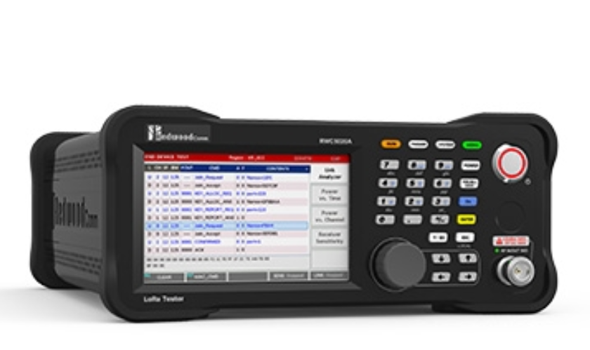
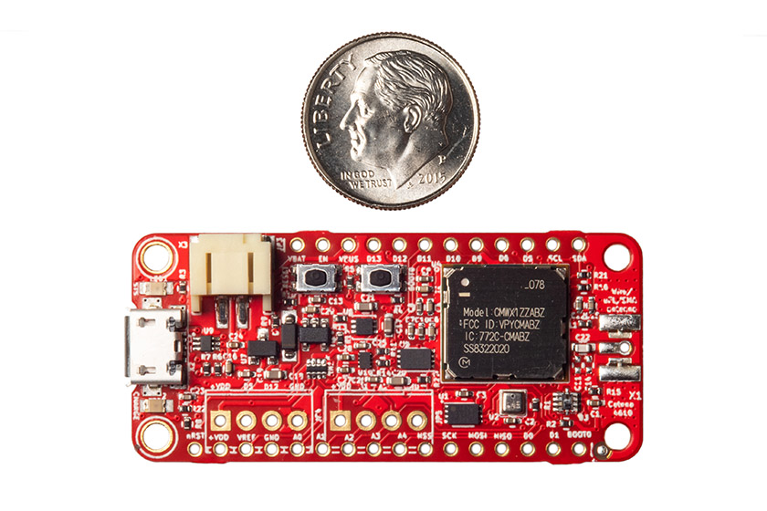

# RedwoodComm RWC5020x Non-Signaling Test sketch

This sketch is used with a [RedwoodComm](http://redwoodcomm.com/product/01.php?cate_1=32) RWC5020A or RWC5020B LoRaWAN Tester to demonstrate non-signaling test mode for testing LoRa&reg; devices in production. Note that this can be used with any LoRa radio; use of LoRaWAN&reg; packet format is not assumed or required.

| RWC 5020A/B LoRaWAN Tester | MCCI Catena&reg; 4610 Test device
|-----------|------
| [](http://redwoodcomm.com/product/01.php?cate_1=32 "Link to RWC5020B product home page") | [](https://mcci.io/catena4610 "Link to MCCI Catena 4610 product page")

## About NST (Non-Signaling Test)

In manufacturing, you need to get devices through the RF test stage as quickly as possible. The LoRaWAN protocol has many delays and therefore is quite time consuming when operating during test.

The RWC5020 testers provide special features that let you quickly test devices without using the LoRaWAN protocol. This sketch shows how to take advantage of these features. The RedwoodComm application note "[Remote Example for Production Tests](http://redwoodcomm.com/lib/download.php?file_name=Remote_Example_for_Production_Tests_v1.2.pdf&save_file=a_201908130454350.pdf&meta=free)" shows the full concept of how this can be done using Ethernet control and a serial port on the test device.

This sketch can be used to evaluate and experiment with the process before you set up your full automation. It also can be used in production, as it fulfills all the requirements of the test procedure; or it can be integrated with a larger application.

For this test, we use the [MCCI Catena 4610](https://mcci.io/catena4610) as the device under test. This sketch will also work with any device supported by the [Arduino LMIC](https://github.com/mcci-catena/Arduino-LMIC/) as maintained by MCCI.

## Overview of Sketch

The sketch is very simple: it boots up, and then waits for direction from the USB port.

Commands are given as single characters. Commands are not case sensitive. The defined commands are.

- `t` to run a transmit test
- `r` to run a receive test
- `c` to print the results of a receive test.

During setup, the sketch prints a quick prompt:

```console
Starting rwc_nst_tx_test1
Frequency: 902.3MHz  LMIC.datarate: 3  LMIC.txpow: 21
```

The Frequency and data rate are important for setting up the RWC5020A.

## RWC5020A setup

First, set up the parameters:

`Param` > `RF`: set `FREQ` to the uplink frequency that was displayed by the sketch. (Hint: the sketch will display the frequency.)

`Param` > `NST_RX`: most defaults are OK, but set `SF` to the spreading factor that matches the displayed data rate for your selected region.  Normally the sketch tries to choose a data rate that corresponds to SF7.

## Transmit Tests

Put the RWC5020x in Signal Analyzer mode, and press `RUN`.

Then press the `t` key. The sketch sends 3 uplink messages then stops.  Output looks like this:

```console
t...tx complete
```

Check to confirm that the messages were properly received. You can edit the sketch to change the number of uplinks.

## Receive Tests

First, start the test at the device, by pressing the `r` key.

Next, put the RWC5020x in Signal **Generator** mode, and press `RUN`.

The sketch will receive packets from the RWC5020x and will print a '`.`' for each message received. It will also increment a counter. After 5 seconds, the sketch will time out and finish the test.

To get the count of received messages, press the `c` key.

A complete test and fetch of receive count looks like this:

```console
rstart RX test
..........end RX test
c
RxCount:10
```

## Automation Notes

Refer to "[Remote Example for Production Tests](http://redwoodcomm.com/lib/download.php?file_name=Remote_Example_for_Production_Tests_v1.2.pdf&save_file=a_201908130454350.pdf&meta=free)" for instructions on how a completely automatic test can be built by using the remote-control features of the RWC5020 and a test control computer.

## Meta

LoRa is a registered trademark of Semtech Corporation. MCCI and MCCI Catena are registered trademarks of MCCI Corporation. LoRaWAN is a registered trademark of the LoRa Alliance. All other marks are the properties of their respective owners.
