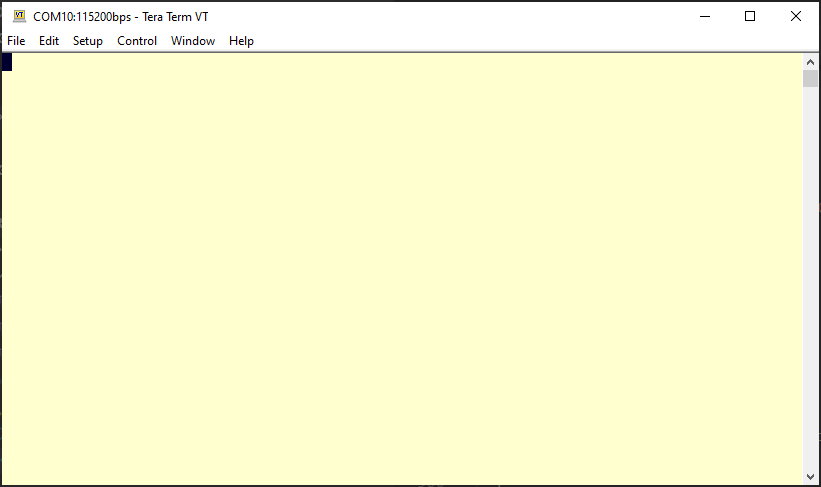

# RedwoodComm RWC5020x Non-Signaling Test Demo Sketch

This sketch is used with a [RedwoodComm](http://redwoodcomm.com/product/01.php?cate_1=32) RWC5020A or RWC5020B LoRaWAN Tester to demonstrate non-signaling test mode for testing LoRa&reg; devices in production. Note that this can be used with any LoRa radio; use of LoRaWAN&reg; packet format is not assumed or required.

<!--
  This TOC uses the VS Code markdown TOC extension AlanWalk.markdown-toc.
  We strongly recommend updating using VS Code, the markdown-toc extension and the
  bierner.markdown-preview-github-styles extension. Note that if you are using
  VS Code 1.29 and Markdown TOC 1.5.6, https://github.com/AlanWalk/markdown-toc/issues/65
  applies -- you must change your line-ending to some non-auto value in Settings>
  Text Editor>Files.  `\n` works for me.
-->
<!-- markdownlint-disable MD033 MD004 -->
<!-- markdownlint-capture -->
<!-- markdownlint-disable -->
<!-- TOC depthFrom:2 updateOnSave:true -->

- [About NST (Non-Signaling Test)](#about-nst-non-signaling-test)
- [Overview of Sketch](#overview-of-sketch)
    - [Required Libraries](#required-libraries)
    - [Using `git-repos.dat` and `git-boot.sh`](#using-git-reposdat-and-git-bootsh)
- [RWC5020 setup](#rwc5020-setup)
- [Transmit Tests](#transmit-tests)
- [Receive Tests](#receive-tests)
- [Sample run](#sample-run)
- [Automation Notes](#automation-notes)
- [Meta](#meta)

<!-- /TOC -->
<!-- markdownlint-restore -->
<!-- Due to a bug in Markdown TOC, the table is formatted incorrectly if tab indentation is set other than 4. Due to another bug, this comment must be *after* the TOC entry. -->

| RWC 5020A/B LoRaWAN Tester | MCCI Catena&reg; 4610 Test device
|-----------|------
| [](http://redwoodcomm.com/product/01.php?cate_1=32 "Link to RWC5020B product home page") | [](https://mcci.io/catena4610 "Link to MCCI Catena 4610 product page")

## About NST (Non-Signaling Test)

In manufacturing, you need to get devices through the RF test stage as quickly as possible. The LoRaWAN protocol has many delays and therefore is quite time consuming when operating during test.

The RWC5020 testers provide special features that let you quickly test devices without using the LoRaWAN protocol. This sketch shows how to take advantage of these features. The RedwoodComm application note "[Remote Example for Production Tests](http://redwoodcomm.com/lib/download.php?file_name=Remote_Example_for_Production_Tests_v1.2.pdf&save_file=a_201908130454350.pdf&meta=free)" shows the full concept of how this can be done using Ethernet control and a serial port on the test device.

This sketch can be used to evaluate and experiment with the process before you set up your full automation. It also can be used in production, as it fulfills all the requirements of the test procedure; or it can be integrated with a larger application.

For this test, we use the [MCCI Catena 4610](https://mcci.io/catena4610) as the device under test. This sketch will also work with any device supported by the [Arduino LMIC](https://github.com/mcci-catena/Arduino-LMIC/) as maintained by MCCI.

## Overview of Sketch

The sketch is conceptually very simple: it boots up, and then waits for direction from the USB port. It's spread out into three code files.

- `rwc_nst_test.ino` is the main program; it contains the logic for `setup()` and `loop()`. As is common in MCCI applications, it uses the Catena polling engine to do most of the work, so there's no run-time logic apparent in this file.

- `rwc_nst_test_cmd.cpp` parses commands. It sends events to the test object.

- `rwc_nst_test_cTest.cpp` implements the test object. This is a finite state machine that gets messages from the command line and events from the radio.

The sketch uses the standard Catena command line interpreter.

Commands are given as lines of text, terminated by a new-line. Commands are not case sensitive. The defined commands are.

- `tx` to run a transmit test
- `rx` to run a receive test
- `count` to print the results of a receive test, and to abort any running tests
- `param` to change test parameters.

During setup, the sketch prints a quick prompt:

```console
----------------------------------------------------------------------------
This is rwc_nst_test.ino v0.6.0.0.
Target network: The Things Network / us915
System clock rate is 32.000 MHz
Enter 'help' for a list of commands.
Please select 'Line Ending: Newline' in the IDE monitor window.
If using a terminal emulator, please turn off local echo.
----------------------------------------------------------------------------

FLASH found, put power down
Idle
```

The Frequency and data rate are important for setting up the RWC5020A.

### Required Libraries

| Library | Recommended Version | Minimum Version | Comments |
|---------|:-------:|:----:|----------|
| [`arduino-lmic`](https://github.com/mcci-catena/arduino-lmic) | HEAD | 2.3.0 | Earlier versions will fail to compile due to missing `lmic_pinmap::rxtx_rx_polarity` and `lmic_pinmap::spi_freq` fields. |
| [`arduino-lorawan`](https://github.com/mcci-catena/arduino-lorawan) | 0.6.0 | 0.5.3.50 | Needed in order to support the Murata module used in the Catena 4551, and for bug fixes in LoRaWAN::begin handling. |
| [`catena-mcciadk`](https://github.com/mcci-catena/Catena-mcciadk) | 0.2.1 | 0.1.2 | Needed for miscellaneous definitions |
| [`Catena-Arduino-Platform`](https://github.com/mcci-catena/Catena-Arduino-Platform) | 0.17.0 | 0.17.0 | Needed for command line processing |

### Using `git-repos.dat` and `git-boot.sh`

The MCCI script [`git-boot.sh`](https://github.com/mcci-catena/Catena-Sketches/blob/master/git-boot.sh) (part of [`Catena-Sketches`](https://github.com/mcci-catena/Catena-Sketches)) can be used to automatically download libraries required for this sketch. The script fetches from HEAD of the default branch.

```bash
# fetch git-boot.sh to /tmp
curl -o /tmp/git-boot.sh https://raw.githubusercontent.com/mcci-catena/Catena-Sketches/master/git-boot.sh

# run git-boot.sh to update the libraries.
cd ~/Documents/Arduino/sketches/rwc_nst_tst
# use the -g option if you want a git-method clone; default is HTTPS.
/tmp/git-boot.sh ./git-repos.dat
```

For example:

```console
$ /tmp/git-boot.sh ./git-repos.data
Cloning into 'Catena-Arduino-Platform'...
remote: Enumerating objects: 8, done.
remote: Counting objects: 100% (8/8), done.
remote: Compressing objects: 100% (5/5), done.
Recote: Total 2796 (delta 3), reused 8 (delta 3), pack-reused 2788 eceiving objects:  98% (2741/2796)
Receiving objects: 100% (2796/2796), 685.97 KiB | 6.79 MiB/s, done.
Resolving deltas: 100% (2135/2135), done.
Cloning into 'Catena-mcciadk'...
remote: Enumerating objects: 33, done.
remote: Counting objects: 100% (33/33), done.
remote: Compressing objects: 100% (23/23), done.
Receiving objects:  92% (170/184)used 19 (delta 9), pack-reused 151
Receiving objects: 100% (184/184), 49.38 KiB | 9.88 MiB/s, done.
Resolving deltas: 100% (89/89), done.
Cloning into 'arduino-lmic'...
remote: Enumerating objects: 10, done.
remote: Counting objects: 100% (10/10), done.
remote: Compressing objects: 100% (9/9), done.
remote: Total 4834 (delta 1), reused 4 (delta 1), pack-reused 4824
Receiving objects: 100% (4834/4834), 12.73 MiB | 6.52 MiB/s, done.
Resolving deltas: 100% (3252/3252), done.
Cloning into 'arduino-lorawan'...
remote: Enumerating objects: 46, done.
remote: Counting objects: 100% (46/46), done.
remote: Compressing objects: 100% (33/33), done.
remote: Total 859 (delta 17), reused 29 (delta 13), pack-reused 813R
Receiving objects: 100% (859/859), 214.78 KiB | 7.67 MiB/s, done.
Resolving deltas: 100% (538/538), done.

==== Summary =====
*** No repos with errors ***

*** No existing repos skipped ***

*** No existing repos were updated ***

New repos cloned:
Catena-Arduino-Platform Catena-mcciadk          arduino-lmic            arduino-lorawan
```

## RWC5020 setup

Choose the test frequency to be used. The default can be found by using `param` command and looking for "Frequency: ".  The RWC5020 and the device under test must use the same frequency. The default in the device is currently 902.3 MHz.

To change the frequency on the RWC5020, first, set up the parameters:

`Param` > `RF`: set `FREQ` to the uplink frequency that was displayed by the sketch. (Hint: the sketch will display the frequency.)

`Param` > `NST_RX`: most defaults are OK, but set `SF` to the spreading factor that matches the displayed data rate for your selected region.  The sketch defaults to SF7. This can be changed using `param SpreadingFactor #`, where `#` is `7`, `8`, `9`, `10`, `11`, or `12`.

## Transmit Tests

Put the RWC5020x in Signal Analyzer mode, and press `RUN`.

Then enter a `tx` command at the Catena (enter `tx`, Enter; or use the IDE to send `tx`). The sketch sends a small number of uplink messages then stops. The number of messages is controlled by `param TxCount`, normally 3. Output looks like this:

```console
tx
Start TX test: 4 bytes, 3 packets. Freq=902300000 Hz, LoRa SF7, BW125, TxPwr 0 dB, CR 4/5, CRC=1, LBT=0 us/-80 dB, clockError=0.0 (0x0)
<tx>
OK
<tx>
<tx>

Tx test complete.
Idle
```

Check to confirm that the messages were properly received. You can change parameters using the `param` command. Defaults are:

```console
param
Bandwidth: 125
ClockError: 0.0%
CodingRate: 4/5
Frequency: 902300000
LBT.dB: -80
LBT.time: 0
RxTimeout: 5000
SpreadingFactor: 7
TxInterval: 2000
TxPower: 0
TxTestCount: 3
OK
```

You can get help on the parameters:

```console
param help
Bandwidth: 125, 250, or 500 (kHz)
ClockError: clock error (%)
CodingRate: coding rate (4/8, 5/8, 6/8, 7/8)
Frequency: test frequency (Hz)
LBT.dB: listen-before-talk maximum signal (dB)
LBT.time: listen-before-talk measurement time (us)
RxTimeout: receive timeout (ms)
SpreadingFactor: 7-12 or FSK
TxInterval: transmit interval (ms)
TxPower: transmit power (dB)
TxTestCount: transmit test repeat count
OK
```

## Receive Tests

First, start the test at the device, by entering the `rx` command and pressing enter.

Next, put the RWC5020x in Signal **Generator** mode, and press `RUN`.

The sketch will receive packets from the RWC5020x and will print a '`.`' for each message received. It will also increment a counter. After a while (default 5 seconds), the sketch will time out and finish the test.

To get the count of received messages, enter the `count` command and press enter.

A complete test and fetch of receive count looks like this:

```console
rx
Start RX test: capturing raw downlink for 5000 milliseconds.
At RWC5020, select NST>Signal Generator, then Run.
Freq=900000000 Hz, LoRa SF7, BW125, TxPwr 0 dB, CR 4/5, CRC=1, LBT=0 us/-80 dB, clockError=0.0 (0x0)
OK
..........
RX test complete: received messages: 10.
Idle
count
RxCount: 10
OK
```

## Sample run

Here's a quick demo:



## Automation Notes

Refer to "[Remote Example for Production Tests](http://redwoodcomm.com/lib/download.php?file_name=Remote_Example_for_Production_Tests_v1.2.pdf&save_file=a_201908130454350.pdf&meta=free)" for instructions on how a completely automatic test can be built by using the remote-control features of the RWC5020 and a test control computer.

## Meta

LoRa is a registered trademark of Semtech Corporation. MCCI and MCCI Catena are registered trademarks of MCCI Corporation. LoRaWAN is a registered trademark of the LoRa Alliance. All other marks are the properties of their respective owners.
